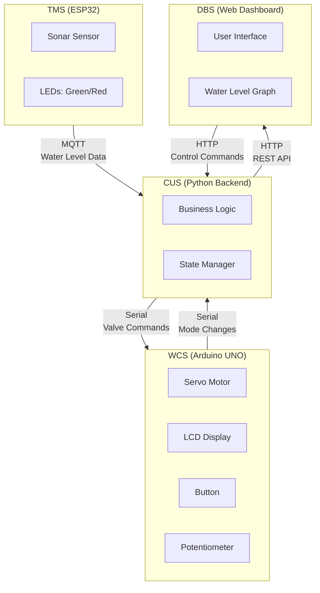

# Smart Tank Monitoring System - Assignment Report

**Course:** Embedded Systems and IoT - ISI LT  
**Academic Year:** 2025/2026  
**Assignment:** #03 - Smart Tank Monitoring System  
**Version:** v1.0.0

---

## Table of Contents

1. [System Overview](#system-overview)
2. [Architecture](#architecture)
3. [Subsystem Descriptions](#subsystem-descriptions)
4. [FSM Diagrams](#fsm-diagrams)
5. [Communication Protocols](#communication-protocols)
6. [Assignment Parameters](#assignment-parameters)
7. [Hardware Schemas](#hardware-schemas)
8. [Demo Video](#demo-video)
9. [Testing & Validation](#testing--validation)

---

## System Overview

The Smart Tank Monitoring System is an IoT solution for monitoring and controlling rainwater levels in a tank. The system automatically manages a water channel valve based on predefined thresholds,  with support for manual override.

### System Components

1. **TMS (Tank Monitoring Subsystem)** - ESP32-based sensor node
2. **CUS (Control Unit Subsystem)** - Python backend server
3. **WCS (Water Channel Subsystem)** - Arduino-based valve controller
4. **DBS (Dashboard Subsystem)** - Web-based monitoring interface

---

## Architecture

### High-Level Architecture Diagram



### Technology Stack

| Component | Technology | Purpose |
|-----------|------------|---------|
| TMS | C++ (ESP32 / Arduino Framework) | Embedded sensor control |
| CUS | Python 3.x (Flask, paho-mqtt, pyserial) | Backend server |
| WCS | C++ (Arduino UNO) | Embedded actuator control |
| DBS | HTML5, CSS3, JavaScript (Chart.js) | Web dashboard |
| MQTT | Mosquitto / Public Broker | TMS ↔ CUS messaging |
| Serial | USB (9600 baud) | WCS ↔ CUS communication |
| HTTP | REST API (port 5000) | DBS ↔ CUS communication |

---

## Subsystem Descriptions

### 1. TMS (Tank Monitoring Subsystem)

**Hardware:** ESP32, Sonar Sensor, 2x LEDs (Green, Red)

**Functionality:**
- Monitors rainwater level using ultrasonic sonar
- Samples at frequency **F = 1 Hz** (1000ms)
- Publishes data to CUS via MQTT
- Visual status indication via LEDs

**FSM States:**
- **INIT**: Hardware initialization
- **CONNECTING**: Establishing WiFi/MQTT connection
- **CONNECTED**: Connection verified
- **MONITORING**: Normal operation (sending data)
- **DISCONNECTED**: Network connection lost

**LED Behavior:**
- ✅ **Green ON, Red OFF**: System working correctly (MONITORING)
- ❌ **Red ON, Green OFF**: Network problems (CONNECTING, DISCONNECTED)
- 🔄 **Both Blinking**: Initializing (INIT)

**See:** [TMS README](../TMS/README.md) | [FSM Diagrams](FSM_Diagrams.md#tms-fsm)

---

### 2. CUS (Control Unit Subsystem)

**Platform:** PC (Windows/Linux/Mac), Python 3.x

**Functionality:**
- Receives water level data from TMS via MQTT
- Implements automatic valve control logic (L₁/L₂ thresholds)
- Manages system modes (AUTOMATIC, MANUAL, UNCONNECTED)
- Communicates with WCS via Serial
- Provides HTTP REST API for DBS
- Stores last **N = 100** measurements

**Business Logic (AUTOMATIC Mode):**

| Condition | Action | Description |
|-----------|--------|-------------|
| Level ≥ L₂ (50 cm) | Valve → 100% | Immediate full opening |
| L₁ ≤ Level < L₂ for T₁ (10s) | Valve → 50% | Delayed half opening |
| Level < L₁ (30 cm) | Valve → 0% | Close valve |
| No TMS data for T₂ (30s) | UNCONNECTED → Valve 0% | Safety closure |

**See:** [CUS README](../CUS/README.md) | [FSM Diagrams](FSM_Diagrams.md#cus-fsm)

---

### 3. WCS (Water Channel Subsystem)

**Hardware:** Arduino UNO, Servo Motor, LCD Display, Button, Potentiometer

**Functionality:**
- Controls servo valve (0-90° range)
- Displays mode and valve percentage on LCD
- Button for mode switching (AUTOMATIC ↔ MANUAL)
- Potentiometer for manual control in MANUAL mode
- Serial communication with CUS

**Servo Mapping:**
- **0%** (Closed) → **0°**
- **50%** (Half) → **45°**
- **100%** (Open) → **90°**

**Modes:**
- **AUTOMATIC**: CUS controls valve via serial
- **MANUAL**: User controls via potentiometer
- **UNCONNECTED**: Valve closed for safety

**See:** [WCS README](../WCS/README.md) | [FSM Diagrams](FSM_Diagrams.md#wcs-fsm)

---

### 4. DBS (Dashboard Subsystem)

**Platform:** Web Browser (Chrome, Firefox, Safari, Edge)

**Functionality:**
- Real-time water level graph (last N=100 measurements)
- Current valve opening display
- System mode indicator
- Mode switching buttons
- Manual valve control slider

**Features:**
- Auto-refresh every 2 seconds
- Responsive design
- Dark theme interface
- Threshold lines (L₁, L₂) on graph

**See:** [DBS README](../DBS/README.md)

---

## FSM Diagrams

Complete FSM diagrams for all subsystems are available in: [`FSM_Diagrams.md`](FSM_Diagrams.md)

### TMS FSM Summary

```
INIT → CONNECTING → CONNECTED → MONITORING
         ↑              ↓            ↓
         └──────── DISCONNECTED ─────┘
```

### CUS Mode FSM Summary

```
AUTOMATIC ←→ MANUAL
    ↓         ↓
UNCONNECTED ──┘
```

### WCS FSM Summary

```
AUTOMATIC ←→ MANUAL
    ↓         ↓
UNCONNECTED ──┘
```

---

## Communication Protocols

### MQTT (TMS ↔ CUS)

**Broker:** `broker.mqtt-dashboard.com:1883`

**TMS Publishes:**
```json
Topic: "tms/rainwater/level"
Payload: {
  "distance": 0.049,
  "level": 199.95,
  "timestamp": 142,
  "state": "MONITORING"
}
```

**Frequency:** Every 1000ms (F = 1 Hz)

---

### Serial (WCS ↔ CUS)

**Protocol:** USB Serial @ 9600 baud, JSON format

**CUS → WCS:**
```json
{"type": "valve", "value": 50}
{"type": "display", "value": "AUTOMATIC"}
```

**WCS → CUS:**
```json
{"type": "mode", "value": "MANUAL"}
{"type": "valve", "value": 75}
```

---

### HTTP (DBS ↔ CUS)

**Base URL:** `http://localhost:5000`

**Endpoints:**

| Method | Endpoint | Description |
|--------|----------|-------------|
| GET | `/api/status` | Get current system status |
| GET | `/api/rainwater` | Get water level history (N measurements) |
| POST | `/api/mode` | Switch mode (AUTOMATIC/MANUAL) |
| POST | `/api/valve` | Set valve opening (MANUAL mode only) |
| GET | `/api/config` | Get system configuration (L₁, L₂, T₁, T₂, N) |
| GET | `/health` | Health check |

---

## Assignment Parameters

All assignment parameters are fully implemented and documented in code:

| Parameter | Symbol | Value | Description | Location |
|-----------|--------|-------|-------------|----------|
| **Sampling Frequency** | F | 1 Hz<br/>(1000ms) | Water level sampling rate | [`TMS/src/config.h`](../TMS/src/config.h#L28) |
| **First Threshold** | L₁ | 30 cm | Level for 50% valve opening | [`CUS/src/config.py`](../CUS/src/config.py#L12) |
| **Second Threshold** | L₂ | 50 cm | Level for 100% valve opening | [`CUS/src/config.py`](../CUS/src/config.py#L16) |
| **L₁ Time Delay** | T₁ | 10 sec | Delay before opening at L₁ | [`CUS/src/config.py`](../CUS/src/config.py#L20) |
| **TMS Timeout** | T₂ | 30 sec | Time before UNCONNECTED | [`CUS/src/config.py`](../CUS/src/config.py#L24) |
| **Measurements** | N | 100 | Dashboard graph size | [`CUS/src/config.py`](../CUS/src/config.py#L28) |

---

## Hardware Schemas

### TMS (ESP32) Breadboard


**Component Connections:**
- **Sonar Sensor:**
  - TRIG → GPIO 7
  - ECHO → GPIO 8
  - VCC → 5V
  - GND → GND
- **Green LED:**
  - Anode → GPIO 3 (with 220Ω resistor)
  - Cathode → GND
- **Red LED:**
  - Anode → GPIO 9 (with 220Ω resistor)
  - Cathode → GND

---

### WCS (Arduino UNO) Breadboard


**Component Connections:**
- **Servo Motor:**
  - Signal → Pin 3 (PWM)
  - VCC → 5V (external supply recommended)
  - GND → GND
- **LCD Display (I2C):**
  - SDA → A4
  - SCL → A5
  - VCC → 5V
  - GND → GND
- **Button:**
  - One side → Pin 9
  - Other side → GND
  - 10kΩ pull-down resistor
- **Potentiometer:**
  - Wiper → A0
  - Other pins → 5V and GND

---

## Demo Video

**Video Link:** [Smart Tank Monitor Demo](https://youtu.be/YOUR_VIDEO_LINK)

**Video Contents:**
1. System startup sequence (all subsystems)
2. Water level monitoring in AUTOMATIC mode
3. L₁ threshold trigger (50% valve opening)
4. L₂ threshold trigger (100% valve opening)
5. Mode switch to MANUAL via button
6. Manual valve control via potentiometer
7. Mode switch via dashboard
8. TMS disconnect simulation (UNCONNECTED state)
9. TMS reconnection
10. Complete system demonstration

**Duration:** ~5 minutes

---

## Testing & Validation

### Unit Tests

#### TMS
- ✅ Sonar distance measurement
- ✅ LED state transitions
- ✅ MQTT publish functionality
- ✅ WiFi connection handling
- ✅ FSM state transitions

#### CUS
- ✅ MQTT message reception
- ✅ L₁/L₂ threshold logic
- ✅ T₁ time delay logic
- ✅ T₂ timeout detection
- ✅ Serial communication
- ✅ HTTP API endpoints

#### WCS
- ✅ Servo angle mapping (0-90°)
- ✅ Button mode switching
- ✅ Potentiometer input
- ✅ LCD display updates
- ✅ JSON serial parsing
- ✅ FSM state transitions

#### DBS
- ✅ API communication
- ✅ Real-time graph updates
- ✅ Mode switching UI
- ✅ Manual valve control
- ✅ Connection status detection

---

### Integration Tests

- ✅ **TMS → CUS**: MQTT data transmission
- ✅ **CUS → WCS**: Serial valve commands
- ✅ **WCS → CUS**: Serial mode notifications
- ✅ **CUS → DBS**: HTTP API responses
- ✅ **End-to-End**: Full system workflow

---

### Validation Results

| Test Case | Expected | Result | Status |
|-----------|----------|--------|--------|
| Water level > L₂ | Valve 100% | Valve opened to 100% | ✅ PASS |
| Water level > L₁ for T₁ | Valve 50% | Valve opened to 50% after 10s | ✅ PASS |
| Water level < L₁ | Valve 0% | Valve closed | ✅ PASS |
| TMS disconnect > T₂ | UNCONNECTED | System entered UNCONNECTED after 30s | ✅ PASS |
| Button press in AUTO | MANUAL mode | Mode switched to MANUAL | ✅ PASS |
| Button press in MANUAL | AUTO mode | Mode switched to AUTO | ✅ PASS |
| Dashboard mode switch | Mode change | System mode changed via web | ✅ PASS |
| Potentiometer in MANUAL | Valve follows | Valve tracked potentiometer | ✅ PASS |

---

## Project Structure

```
assignment-03/
├── TMS/                    # Tank Monitoring Subsystem (ESP32)
│   ├── src/
│   │   ├── config.h       # Configuration with F parameter
│   │   ├── main.cpp       # Main entry point
│   │   ├── devices/       # Sonar, LED implementations
│   │   ├── kernel/        # MQTT, Scheduler
│   │   └── task/          # Monitoring, MQTT, LED tasks
│   ├── platformio.ini     # PlatformIO configuration
│   └── README.md          # TMS documentation
│
├── CUS/                    # Control Unit Subsystem (Python)
│   ├── src/
│   │   ├── config.py      # L₁, L₂, T₁, T₂, N parameters
│   │   ├── business_logic.py
│   │   ├── state_manager.py
│   │   ├── mqtt_handler.py
│   │   ├── serial_handler.py
│   │   └── http_server.py
│   ├── cus_main.py        # Main entry point
│   ├── pyproject.toml     # Python dependencies
│   └── README.md          # CUS documentation
│
├── WCS/                    # Water Channel Subsystem (Arduino)
│   ├── src/
│   │   ├── config.h       # Servo 0-90° configuration
│   │   ├── main.cpp       # Main entry point
│   │   ├── devices/       # Servo, LCD, Button, Pot
│   │   ├── kernel/        # Scheduler, SerialComm
│   │   └── tasks/         # WCSTask implementation
│   ├── platformio.ini     # PlatformIO configuration
│   └── README.md          # WCS documentation
│
├── DBS/                    # Dashboard Subsystem (Web)
│   ├── index.html         # Main HTML page
│   ├── css/
│   │   └── styles.css     # Styling
│   ├── js/
│   │   ├── config.js      # Configuration
│   │   ├── api.js         # HTTP API client
│   │   ├── chart.js       # Graph visualization
│   │   ├── controls.js    # User interactions
│   │   └── app.js         # Main application
│   └── README.md          # DBS documentation
│
└── doc/                    # Documentation
    ├── report.md          # This file
    ├── FSM_Diagrams.md    # FSM diagrams (Mermaid)
    ├── breadboard_tms.png # TMS circuit diagram
    └── breadboard_wcs.png # WCS circuit diagram
```

---

## Installation & Running

### Prerequisites
- ESP32 with PlatformIO
- Arduino UNO with PlatformIO
- Python 3.8+ with `uv`
- Web browser (Chrome/Firefox recommended)

### Quick Start

```bash
# 1. Upload TMS to ESP32
cd TMS
pio run --target upload

# 2. Upload WCS to Arduino
cd ../WCS
pio run --target upload

# 3. Start CUS
cd ../CUS
uv run cus_main.py

# 4. Open DBS
cd ../DBS
python -m http.server 8080
# Open browser to http://localhost:8080
```

**Detailed instructions:** See individual README files in each subsystem directory.

---

## Conclusion

The Smart Tank Monitoring System successfully implements all assignment requirements:

✅ **TMS**: ESP32-based monitoring with FSM, MQTT communication  
✅ **CUS**: Python backend with L₁/L₂/T₁/T₂ logic, multi-protocol support  
✅ **WCS**: Arduino-based valve control with FSM, serial communication  
✅ **DBS**: Web dashboard with real-time visualization  

All assignment parameters (F, L₁, L₂, T₁, T₂, N) are implemented and documented. The system provides both automatic and manual control modes with appropriate safety features (UNCONNECTED state).

---

## References

- [ESP32 Documentation](https://docs.espressif.com/projects/esp-idf/en/latest/esp32/)
- [Arduino Reference](https://www.arduino.cc/reference/en/)
- [MQTT Protocol](https://mqtt.org/)
- [Flask Documentation](https://flask.palletsprojects.com/)
- [Chart.js Documentation](https://www.chartjs.org/)
